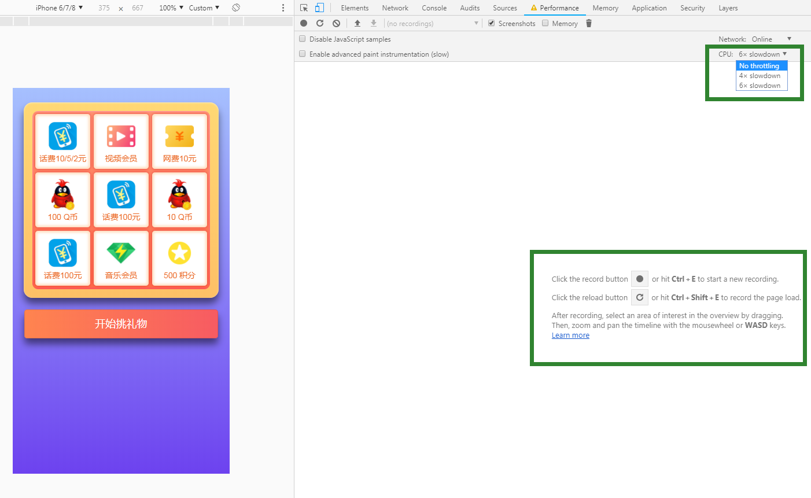
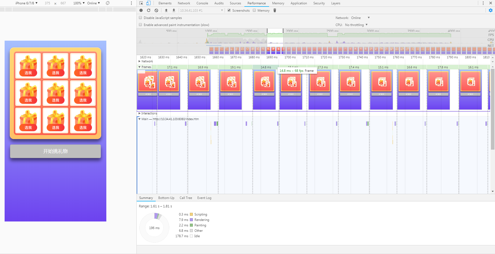
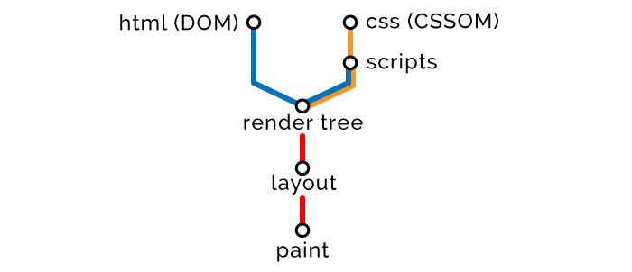

# css动画优化
## 前言
在现代的web开发中，css3动画是一个很常用的功能了，经常用到的就是**transition**变化和**animate**动画，二者可以替代以前的dom操作元素变化来达到动画的目的，可谓是大大提高了web前端的动画生产力，不过我们在使用中或许鲜有了解其性能，只是在一些h5中会发现出现一些**卡顿和掉帧**的现象，多半也就归结为移动端性能差，没有究其根本。

最近一个项目也恰好遇到移动端动画性能问题，查了些资料，顺便做一些分析总结。

## 动画原理
纸片动画大家都见过，翻动纸片小人儿会奔跑起来，原因就是人的大脑具有视觉暂留的作用，人的大脑的视觉处理中心每秒可以识别10-12个画面，大脑会将每格画面保留**1/15秒**左右，那么只要保证1/15秒内有图片更新，大脑就会认为两张图片是流畅连接起来的。
   
这也是现代电影的认知学基础，只不过人的感光系统对闪烁的感知，如果每秒15张图片的更新会让动画显得生硬，例如我们小时候都看过的卓别林**默片**，默片的每秒图片变化数大概就是16张，所以我们看起来动作是一惊一乍的，并不流畅。

所以现代电影一般是每秒24格图片，再加上特殊的叶子板结构这样就能让电影的观影体验变得流畅。
每秒中出现的图片次数就被称为**赫兹**单位为**hertz**，赫兹可以很大，远远超出我们人眼的每秒12张的处理能力，但是我们肉眼只能处理出12张，那么多余的赫兹则可能被忽略，这个时候我们肉眼能处理的赫兹数量就是显示器中经常提到的刷新率，也就是每秒能处理的**帧数**单位为**fps**,一般来说wx系统显示器能处理的帧数为**每秒60帧**，也就是每秒钟显示器**刷新60次**,每刷新一次所需要的时间就是**1/60*1000=16.6ms**。
## 出现卡顿的原因
由于显示器的刷新率是固定的60次每秒，那么如果每一次刷新都会有不同的动画产生，那么动画看起来就是流畅的，这就要求我们的计算机保证每秒60张动画图片的输出，但是如果你写出来的css3动画性能太差，就会导致每秒达不到60张连续动画的输出，这个时候就是我们常说的**掉帧**，掉帧导致中间部分图片丢失，这样就会看起来出现了卡顿，所以让css3动画流程的核心就是尽可能减少css3动画的性能开销，提高帧数。

提高性能首先要知道我们的动画性能问题出在哪里，那么如何查看呢？
## 怎样查看css3动画的性能
chrome浏览器调试工具为我们提供了性能相关的调试功能，打开开发者工具，我们可以选中**Performance**选项，在这里我们可以看到各项资源的加载情况，耗时，模拟弱CPU弱网环境。
打开我最近做的一个动画页面，动画较为简单，之所以没有选取较为极端复杂的动画来模拟性能问题是因为我们平时遇到的动画可能性能差异并不是特别大，这样可能更容易忽视其性能问题，这样性能差异小的情况下能让我们能更客观分析出动画性能情况。

这是打开Performancem面板的调试页面，面板上部分是常用的筛选项，其中的**CPU选项**是我们尤其要注意的，我们将用他来模拟CPU性能，4X和6X分别代表慢速度倍速；面板中部是**性能记录按钮**，performance是对网页进行**时间段截取**来获取该时间段内的性能数据，可以获取页面加载完成后一段时间内的性能数据，也可以获取loading阶段的数据情况。

由于我们需要获取的是动画阶段的性能情况，所以就点击第一个按钮就好了，分三步走：
1. 点击第一个record button，开始记录页面表现，这时控制台面板会出现记录的时间和可用的Buffer数据量
2. 点击html页面开始动画，直到动画完成
3. 点击控制面板的stop按钮停止
记录结果如下：

图中顶部的三条图标分别代表绿色的FPS,中间的CPU,底部是各个点的图片缩略图，可以使用鼠标点击图标选择任意一段，也可以滚动鼠标进行范围的放大或缩小进行数据范围的查看，也可以展开并且拖动下方的Frames栏目里面的片段图来缩放，其中绿色条上的数字是当前每秒渲染的帧数以及单帧的时间，如果帧数保证在60左右，那么说明动画很流畅，并没有什么问题，如果越低则说明其性能越差。
## 前端代码中容易埋下的性能问题
在了解前端的性能问题之前先了解一下浏览器的[渲染网页流程](http://jinlong.github.io/2017/05/08/optimising-the-front-end-for-the-browser/)，如下：
  * 使用 HTML 创建文档对象模型（DOM）
  * 使用 CSS 创建 CSS 对象模型（CSSOM）
  * 基于 DOM 和 CSSOM 执行脚本（Scripts）
  * 合并 DOM 和 CSSOM 形成渲染树（Render Tree）
  * 使用渲染树布局（Layout）所有元素
  * 渲染（Paint）所有元素

  
  
  #### html资源加载顺序优化策略：
  通过上图可以看到：
  * html,css,script的加载顺序依次是html>css>script。
  * 其中dom和cssom是同时进行的不会相互阻塞，但是在该部分dom前面如果有css,则cssom和dom都必须加载完成才能生成该部分渲染树，如果没有该dom会直接渲染出来，所以如果css放顶部会影响所有dom的渲染，白屏时间会变长，如果放在底部则dom加载很快，但是最开始会出现无样式的尴尬情况。
  * css不会阻塞dom树的解析，只是会影响渲染树的生成。
  * js的加载要依赖于**渲染树**，这是因为js中有可能去获取css的样式js标签之前如果有css，会等待css加载完成再生成dom，并且js会阻塞dom数的渲染。

  所以我们通常的做法将css放在顶部作用在于避免dom加载样式错乱，加快css的加载速度避免阻塞css阻塞；将js放在底部作用在于避免dom的阻塞，而且js始终需要等待css的加载完成，所以放在下面会减少一个dom渲染的时间，而且浏览器会提前预加载资源。

  #### html的重绘和重排
  上面的浏览器渲染流程图可以看到dom树先进行了排序，即对整个文档dom树的各个元素的宽高，距离等进行了计算，然后对其在屏幕上进行了绘制，如果我们对dom进行操作，那么势必会影响到dom的重拍和重绘，进而影响到性能问题。

**常见的重排**：

* 添加或者删除可见的元素
* 元素位置改变
* 元素尺寸改变
* 元素内容改变
* 页面渲染初始化
* 浏览器窗口发生变化

常见的浏览器窗口发生变化我们都要进行防抖函数的编写来避免频繁操作dom,节约性能

```js

function debounce(fun, interval) {
  var timer = null;

  return function() {
    let self = this,//保持this指向dom对象
        args = arguments;

    clearTimeout(timer);
    timer = null;
    timer = setTimeout(function() {
      fun.apply(self, args);
    }, interval);
  }
}

var scroll_fun = debounce(function() {
  let scrollTop = document.body.scrollTop || document.documentElement.scrollTop;
    console.log('滚动条位置：' + scrollTop);
}, 300);

window.addEventlistener('scroll', scroll_fun);
```
**函数防抖**的作用是用在例如window.onscroll等频繁触发的事件上，让函数在最近的事件等待多少时间后触发，如果有重复事件则清除当前纪时，简单点讲就是**频繁触发的事件停下来等待指定时间后再触发事件函数**

除了函数防抖还有一个常用的方法是**函数截流**，函数截流是指函数在固定的间隔时间触发。比如滚动懒加载的图片，如果用户一致滚动页面，那么便会不断触发滚动事件，这时候的防抖函数始终不会触发，所以需要让事件函数在执行完成后多少时间后才能继续触发，这就是**函数截流**了。
```js

function throtte(fun, time, delay) {
  var t_last = +new Date();
  var timer;
  return function loop () {
    let self = this,//保持this指向dom对象
        args = arguments;
    
    let t = +new Date();
    if(t - t_last > time) {
      fun.apply(self, args);
    }
    else {
      clearTimeout(timer);
      timer = null;
      timer = setTimeout(function() {
        loop.apply(self, args);
      }, delay);
    }
  }
}

var scroll_fun = throtte(function() {
  console.log('fun start');
}, 300, 50);

window.addEventlistener('scroll', scroll_fun);
```
以上二者都能防止函数过于频繁的调用。
区别在于，当事件持续被触发，如果触发时间间隔短于规定的等待时间（n秒），那么

* 函数防抖的情况下，函数将一直推迟执行，造成**不会被执行**的效果；
* 函数节流的情况下，函数将**每个 n 秒**执行一次。


