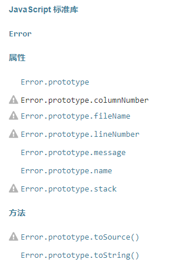
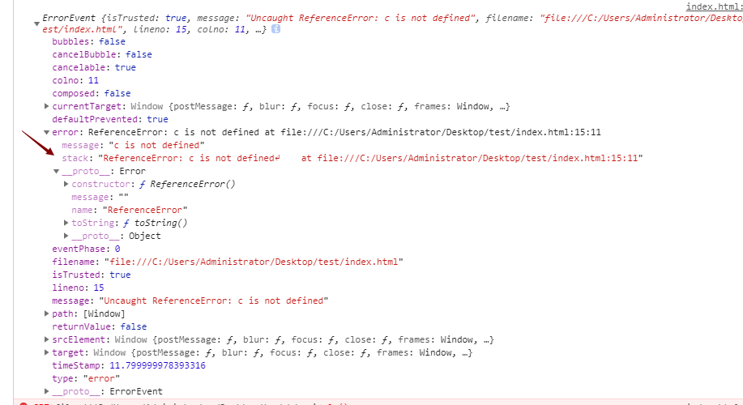
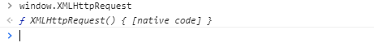
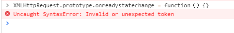

# js错误捕捉
* [前言](#sec1)
* [认识Error错误对象](#sec2)
* [try...catch进行错误捕捉](#sec3)
* [全局捕捉 window.onerror 和 window.addEventListener('error', handler, true)](#sec4)
* [XMLHttpRequest请求错误的捕捉](#sec5)
* [非同源（跨域）js导致的error](#sec6)
* [promise函数中的错误捕捉](#sec7)
* [async函数的错误捕捉](#sec8)
* [Generator函数中的错误捕捉](#sec9)
* [Express中的错误捕捉](#sec10)
## <span id="sec1">前言</span>
错误一定会发生
当 JavaScript 引擎执行 JavaScript 代码时，会发生各种错误：
可能是语法错误，通常是程序员造成的编码错误或错别字。
可能是拼写错误或语言中缺少的功能（可能由于浏览器差异）。
可能是由于来自服务器或用户的错误输出而导致的错误。
当然，也可能是由于许多其他不可预知的因素。   
## 认识Error错误对象
#### error特性
* Error对象是一个js内置的**构造函数**，通过new的方式进行实例化，通过throw的方式进行抛出。
* 浏览器对错误的处理过程可以理解为遇到js错误时会自动创建一个error实例对象并且抛出，用户也可以自定义error对象并且通过throw方法抛出,这和浏览器自动抛出错误并没有差别。
* 错误发生会阻止主程序运行，异步错误或者资源加载错误不会阻止主程序运行。

#### error类型
浏览器内置6种错误类型：
* `EvalError`
创建一个error实例，表示错误的原因：与 eval() 有关。
* `InternalError `
创建一个代表Javascript引擎内部错误的异常抛出的实例。 如: "递归太多".
* `RangeError`
创建一个error实例，表示错误的原因：数值变量或参数超出其有效范围。
* `ReferenceError`
创建一个error实例，表示错误的原因：无效引用。
* `SyntaxError`
创建一个error实例，表示错误的原因：eval()在解析代码的过程中发生的语法错误。
* `TypeError`
创建一个error实例，表示错误的原因：变量或参数不属于有效类型。
* `URIError`

可以通过error原型上的`name属性`查看到错误类型，例如：
```js
try {
  var a = c;
}
catch(e) {
  console.log(e.name);
}
>>> ReferenceError
```
#### 手动创建error
通过`new Error()`的方式可以创建自定义错误。
如果通过`new Error()`的方式自定义错误，则默认没有细分错误类型，不过可以手动创建特定类型的错误并抛出，例如：`new ReferenceError()`,表示变量未定义时会报此类型的error错误。
还可以给自定义错误传递额外的信息参数：
**`new Error([message[, fileName[,lineNumber]]])`**
  **`message`** 错误消息
  **`fileName `** 错误发生的文件名（默认为错误发生的文件）
  **`lineNumber `** 错误发生的行号（默认为错误发生行号）

例如如下代码为用户自定义错误并且抛出：
```js
try {
  console.log(a);
}
catch (err) {
  //判断错误类型为ReferenceError
  console.log(err instanceof ReferenceError);
}
>>> true

try {
  throw new Error("a is not defined"); 
}
catch(e) {
  console.log(e.name + ": " + e.message);
}
>>> Error: a is not defined
```
也可以对error对象进行修改，例如修改name,message等信息，不过修改信息只是该实例上的修改，不会修改原型属性。
```js
try {
  var e = new Error("a is not defined"); 
  e.message = "message changed"; 
  throw e; 
}
catch(e) {
  console.log(e.name + ": " + e.message);
}
>>> Error: message changed
```
**Error构造函数**
error构造函数不含有任何的属性和方法,所有的方法和属性都是在**原型链**上进行的继承得到的，可以对其原型链进行方法和属性的**添加**，使得添加的属性和方法在其所有的实例上都生效，但是不得遍历，枚举和重写现有的属性和方法。
```js
Error.prototype 属性的属性特性：
writable	false
enumerable	false
configurable	false
```
* 属性：各浏览器表现不一致，返回的错误信息主要包括：

标准属性有两个**Error.prototype.message错误信息**和**Error.prototype.name错误名**；
Microsoft含有description错误描述和number错误码，Mozila中含有fileName,lineNumber,columnNumber,stack信息。
* 方法：标准方法**Error.prototype.toString()** 返回一个表示该错误对象的字符串，该方法重写了Object.prototype.toString() 方法。js自动创建的错误错误就是调用该方法输出的name和message信息，所以这和手动抛出错误并且输出name和message是相同的。
```js
在chrome中返回
  console.log(err.message); // "a is not defined"
  console.log(err.name);   //ReferenceError             
在ie中返回
  {
    description: "“a”未定义", 
    message: "“a”未定义", 
    name: "ReferenceError", 
    number: -2146823279
  }
//采用tostring方法输出错误信息，和e.name+':'+e.message相同
console.log(err.toString());
>>> c is not defined
```

更多相关用法参考[https://developer.mozilla.org/zh-CN/docs/Web/JavaScript/Reference/Global_Objects/Error]
## <span id="sec3"> 使用try...catch进行错误捕捉<span>
当错误发生时，javascript会抛出错误，如果发生同步js错误，由于javascript是单线程所以其程序会挂起，并生成一个错误消息。
我们可以采用**try...catch**的语法来捕捉错误，将可能发生错误的代码放在try {}语句块中，在catch {}语句块中进行捕捉。

```js
try {
	//在这里运行代码
}
catch() {
	//在这里处理错误
}
finally {
	//无论是否出错，肯定都要执行的代码 (可省略)
}
```
例如下面的代码a在未定义的情况下程序会抛出a is not defined的错误,该错误类型属于系统异常的**ReferenceError**类型；js会停止运行在报错的地方：
```js
console.log(a);
console.log('js will not show this sentence');
>>> Uncaught ReferenceError: a is not defined
```
我们可以采用**try...catch**的语法进行错误处理：
```js
try {
  console.log(a);
  console.log('js will not show this sentence');
}
catch (err) {
  console.log(err);
}
console.log('js still work here');
>>> this is the error msg:ReferenceError: a is not defined
    js still work here
```
try...catch总是**成对**出现，如果只有try而没有catch程序会抛出错误
```js {cmd=true}
try {
  console.log(a);
}
>>> Uncaught SyntaxError: Missing catch or finally after try
```
**try...catch只能捕捉同步执行代码的错误**，对于异步执行的代码无法捕捉，考虑如下代码：
```js
try {
  setTimeout(function() {
    console.log(a);
  }, 100);
}
catch (err) {
    console.log(err)
}
>>> Uncaught ReferenceError: a is not defined
```
同理ajax的错误捕捉也是无效的：
```js
try {
	request(url, function(error, response, body) {
		if (!error && response.statusCode == 200) {
            console.log(body)
        } else {
        	throw new Error("an Error occur")
        }
	})
} catch (e) {
	// 这里并不能捕获回调里面抛出的异常
}
```
此外，try...catch 无法捕捉语法错误，例如if i=1；因为程序在编译阶段就会发现错误并且停止运行。
## <span id="sec4">window.onerror 和 window.addEventListener('error', handler, true)</span>
既然try...catch只能捕捉同步代码错误，那如何能够捕捉或者处理异步函数中的错误呢？
在浏览器宿主环境中提供了**window.onerror属性**和**window.addEventListener**来进行全局的异常监听。
#### window.onerror特性：
  * window.onerror属性接受**5**个参数，
    * `message`：错误信息（字符串）。可用于HTML onerror=""处理程序中的event
    * `source`：发生错误的脚本URL（字符串）
    * `lineno`：发生错误的行号（数字）
    * `colno`：发生错误的列号（数字）
    * `error`：[Error](https://developer.mozilla.org/en-US/docs/Web/JavaScript/Reference/Global_Objects/Error)对象（对象）**window.addEventListener('error', handler, true)** 只有**1**个参数，即发生错误的error对象。
* 只能捕捉**JavaScript运行时错误**的错误,无法捕捉**资源加载错误**，**XHR请求错误**；
* 可以在回调中使用**return true** 来阻止控制台中打印出错误信息。
* onerror属性同级的代码块中不能出现**语法错误**，否则onerror函数无法执行，也就无法进行错误消息的监听了，解决方法是将window.onerror放到单独的js文件中加载，这样也符合业务分离的原则,但是其必须先与其他业务代码**先行加载**。

#### window.addEventListener特性：
  * **window.addEventListener**在**捕获**状态（第三个参数为true）能捕捉到js错误，也能捕捉**http资源**加载错误，**冒泡**阶段（第三个参数为false）只能捕获到js错误。
* 同样**无法捕捉xhr请求**错误，例如（404）等，也**无法捕捉js动态添加的异步资源请求**，例如`var img = new Image();img.src="a.png"`,这样的错误无法捕捉，查看fundebug控制台发现该平台也同样无法捕获该类型的错误。
* 采用**preventDefault**的方法来阻止控制台打印js错误但是对于资源加载错误无法阻止控制台打印。
* window.addEventListener属性同级的代码块中不能出现**语法错误**，否则onerror函数无法执行，也就无法进行错误消息的监听了，解决方法是将window.onerror放到单独的js文件中加载，这样也符合业务分离的原则,但是其必须先与其他业务代码**先行加载**。
```js
window.onerror = function(msg, file, line, col, error) {
    console.log(msg, file, line, col, error);
    return true;//控制台将不会输出错误信息
}
var c = a;


>>> a is not defined http://10.34.43.54:3000/test.js 7 17 ReferenceError: a is not defined
>>> GET file:///C:/Users/Administrator/Desktop/test/abc.png 0 ()
```
上例中的错误会被捕捉，并且由于return true,所以控制台不会打印出错误,
图片产生的错误无法捕捉，控制台会将其打印。
对于图片js,css等**静态资源**请求产生的错误我们可以用window.addEventListener
```js
  window.onerror = handleOnError
  window.addEventListener('error', handleListenerError, true);
  function handleOnError(errorMessage, scriptURI, lineNumber,columnNumber,errorObj) {
  　　console.log(msg, file, line, col, error);
  　　return true // 阻止浏览器console输出
  }
  function handleListenerError (eventErr) {
      console.log(eventErr)
  　　eventErr.preventDefault() // 阻止浏览器console输出
  }
  var a = c;
  
  <script type="text/javascript" src="abc.js"></script>

  >>> ErrorEvent {isTrusted: true, message: "Uncaught ReferenceError: c is not defined", filename:"file:///C:/Users/Administrator/Desktop/test/index.html", lineno: 15, colno: 11, …}
  >>> index.html:23 GET file:///C:/Users/Administrator/Desktop/test/abc.js 0 ()
  >>> index.html:12 Event {isTrusted: true, type: "error", target: script, currentTarget: Window, eventPhase: 1, …}
  >>> index.html:25 GET file:///C:/Users/Administrator/Desktop/test/abc.png 0 ()
  >>> index.html:24 GET file:///C:/Users/Administrator/Desktop/test/abc.js 0 ()
  >>> index.html:12 Event {isTrusted: true, type: "error", target: script, currentTarget: Window, eventPhase: 1, …}
  >>> index.html:12 Event {isTrusted: true, type: "error", target: img, currentTarget: Window, eventPhase: 1, …}
```
其中的error对象如下,包含了我们需要的所有信息：

这样很方便我们进行前端**数据的监控和上报**，配合图片ping的方式进行数据上报

```js
window.onerror = function(msg, file, line, col, error) {
  console.log(msg, file, line, col, error);
  let upload = new Image();
  upload.src = 'http://api.upload?msg='+ 'js 发生错误：'+ msg+ ',行数：'+ line+'：列数：'+ col;
}
或者
window.addEventListener("error", function(msg, file, line, col, error){
  ...
})

```
## <span id="sec5">XMLHttpRequest请求错误的捕捉<span id="sec5">
我们一般也将XMLHttpRequest请求的`非成功状态码（200）`之外的状态归结为错误，也希望对其进行捕捉和监控，
但是由于异步的特性，`try...catch`无法进行捕捉，并且XMLHttpRequest错误不同于`静态资源文件加载错误`，也不具有`冒泡和可捕获`的性质，无法进行全局错误捕捉，事实上**js手动发起的资源加载和XML错误**我们都无法进行全局捕获，也无法产生自动的error对象实例。
不过对于js发起的资源加载例如`var img = new Image();img.src="..."`和XML请求js都提供了对应的回调load和error事件，对于它内部的捕捉我们可以在业务代码中进行采集。
```js
var xhr = new XMLHttpRequest();
xhr.addEventListener('load', function(e) {
  if(e.currentTarget.status === '404') {//404错误上报
    console.log(e.currentTarget.status, e.currentTarget.responseURL);
  }
});
xhr.onreadystatechange = function () {
  if(xhr.readyState==4) {
    if(xhr.status == 200) {
    }
    else if(xhr.status === 404) {//404错误捕捉
    }
  }
}

xhr.open('GET', '.a.html', true);
xhr.send();
```
上例中发生了一个ajax请求，我们可以监控xhr的onreadystatechange事件当xhr.status状态变为404时，则表示请求404错误，也可以监听load事件，同样可以获取event对象中的e.currentTarget.status进行判断。

**但是**这些都是业务层面的监听，如何进行全局的监听，例如像[fundebug](https://www.fundebug.com/)或者[sentry](https://sentry.io/welcome/)监控平台一样不做任何业务层的上报，自动全局上报呢，我们可以修改默认的**XMLHttpRequest构造函数**：
```js
var originalXml = window.XMLHttpRequest;//保存原始的xml对象

//重写XMLHttpRequest对象，添加自定义监听的readystatechange或load事件进行数据上报。
window.XMLHttpRequest = function() {
  var instance = new originalXml();
  instance.addEventListener('load', function(e) {
    if(e.currentTarget.status === '404') {//添加额外事件监听进行404错误上报
      console.log(e.currentTarget.status, e.currentTarget.responseURL);
    }
  });
  instance.addEventListener('readystatechange', function(e) {
    if(instance.status === '404') {//添加额外事件监听进行404错误上报
      console.log(e.currentTarget.status, e.currentTarget.responseURL);
    }
  });
  return instance;
}

//用户自定义的ajax请求，不用做额外的操作即实现了错误数据的采集
function doAjax() {
  var xhr = new XMLHttpRequest();
  xhr.addEventListener('load', function(e) {

  });
  xhr.onreadystatechange = function () {
    if(xhr.readyState==4) {
      if(xhr.status == 200) {
      }
      else if(xhr.status === 404) {
      }
    }
  }

  xhr.open('GET', '.a.html', true);
  xhr.send();
}
```
这样的写法必须保证XMLHttpRequest的重写方法在所有的XMLHttpRequest**实例请求发生之前**,否则错误就无法采集，事实上所有的监控平台代码都**必须先于业务代码**，不然错误就会存在漏采集的情况。

上面的方法其实是一个工厂方法，会重写XMLHttpRequest方法，我们在控制台打印fundebug的XMLHttpRequest   
   
可以看到XMLHttpRequest依然是一个native的function，fundebug并没有重写XMLHttpRequest,那么他是如何操作的呢？
我们可以为onreadystatechange事件添加额外的回调处理函数，直接添加到原型上当然是不行的，   
   
国外有小哥[（文章链接）](https://dmitripavlutin.com/catch-the-xmlhttp-request-in-plain-javascript/)为实例中的onreadystatechange事件添加了全局的处理函数
```js
var open = window.XMLHttpRequest.prototype.open,  
    send = window.XMLHttpRequest.prototype.send;//保存原始的open和send方法

function openReplacement(method, url, async, user, password) {  
  this._url = url;
  return open.apply(this, arguments);
}

function sendReplacement(data) {  
  if(this.onreadystatechange) {
    this._onreadystatechange = this.onreadystatechange;//保存用户实例中的回调函数onreadystatechange
  }
 
  console.log('Request sent');
  
  this.onreadystatechange = onReadyStateChangeReplacement;//重写回调函数onreadystatechange
  return send.apply(this, arguments);
}

function onReadyStateChangeReplacement() {  
  //这儿可以处理额外添加的处理，例如404上报等,arguments对应onreadystatechange中的event对象
  //this对应xhr实例，所以可以根据而且来判断404和上报错误消息
  //console.log(this.status === '404')
  console.log('Ready state changed to: ', this.readyState);
  
  if(this._onreadystatechange) {
    return this._onreadystatechange.apply(this, arguments);//保存用户实例中的回调函数onreadystatechange
  }
}

window.XMLHttpRequest.prototype.open = openReplacement;  
window.XMLHttpRequest.prototype.send = sendReplacement;

var request = new XMLHttpRequest();
request.open('GET', '.', true);
request.send();
```
我们可以打印出XMLHttpRequest对象，他是一个原生的native code；说明我们并没有重写XMLHttpRequest对象，只是对其中的方法进行了重写，但是上面的方法还是有缺陷：
* onreadystatechange的回调函数在send方法调用后才会重写，所以readyState的状态始终是无法捕捉到0（请求）未建立，1（服务器连接建立）的，只能捕获2（请求已接受），3（请求处理中），4（请求已完成，且响应已就绪）。解决办法是将onreadystatechange的回调写法放到open方法前面，这样就能捕捉到为1的服务器连接的状态了。
* 如果onreadystatechange函数写在send方法后面，那么调用send方法是不能获取到onreadystatechange的回调的，所以这时添加的全局onreadystatechange会被send后用户写的onreadystatechange覆盖掉，解决办法是用addEventListener的方法替代on的绑定方法。
代码修改如下
```js
var open = window.XMLHttpRequest.prototype.open,  
  send = window.XMLHttpRequest.prototype.send;

function openReplacement(method, url, async, user, password) {  
  this._url = url;
  if(this.onreadystatechange) {//将onreadystatechange回调放到open方法前面
    this._onreadystatechange = this.onreadystatechange;
  }
 
  console.log('Request sent');
  //用addEventListener的事件绑定方式代替on
  this.addEventListener('readystatechange', onReadyStateChangeReplacement, false);
  return open.apply(this, arguments);
}

function sendReplacement(data) {  
  
  return send.apply(this, arguments);
}

function onReadyStateChangeReplacement() {  
  
  console.log('Ready state changed to: ', this.readyState);
  console.log(arguments)
  
  if(this._onreadystatechange) {
    return this._onreadystatechange.apply(this, arguments);
  }
}

window.XMLHttpRequest.prototype.open = openReplacement;  
window.XMLHttpRequest.prototype.send = sendReplacement;

var request = new XMLHttpRequest();
request.onreadystatechange = function () {
  console.log('===')
  console.log(request.status)
    if(request.readyState==4) {
      if(request.status == 200) {
      }
      else if(request.status === 404) {
      }
    }
  }
request.open('GET', '.', true);
request.send();
```
可将上面代码复制到[jsbin](https://jsbin.com/?js,console)中进行尝试。
## <span id="sec6"> 非同源（跨域）js导致的error</span>
出于安全性的考虑，对于**跨域js请求**资源内的js报错onerror属性无法获取到全部信息，可以[查看MSN的解释](https://developer.mozilla.org/zh-CN/docs/Web/API/GlobalEventHandlers/onerror);
一种做法是采取变通方案，该跨域类型会返回一个`Script error.`的错误字符串，可对其进行判断，给用户友好提示。
```js
//跨域情况下
>>> Script error.  0 0 null
//非跨域情况下
>>> a is not defined http://10.34.43.54:3000/test.js 7 17 ReferenceError: a is not defined
```
或者要想获取到全部信息可以进行如下两个设置：
* 在服务器端启用允许**跨域CORS协议**，设置响应头属性Access-Control-Allow-Origin为'*'允许全部域名访问或者允许访问的白名单域名地址；
* 设置script请求标签头部属性**crossorigin**，表明该js资源是合法跨域访问的资源，该属性支持anonymous和use-credentials两个value值，不设置情况下默认为anonymous，详细可查看[https://developer.mozilla.org/en-US/docs/Web/HTML/CORS_settings_attributes]
```js
response.writeHead(200, {
    'Content-Type': contentType,
    'Access-Control-Allow-Origin': '*'
});
<script src="http://10.34.43.54:8787/test.js" crossorigin></script>
```
## <span id="sec7"> promise函数中的错误捕捉</span>
首先来看一下一个简单的promise对象实现如下：
```js
function Promise(cb) {
  this.status = 'pending';
  try {
    cb(this.resolve, this.reject);
  }
  catch(err) {
    this.status = 'error';
    this.erorMsg = err;
    return this;
  }
}
Promise.prototype.resolve = function() {
  this.status = 'resolved';
  return this;
}
Promise.prototype.reject = function() {
  this.status = 'rejected';
  return this;
}
Promise.prototype.then = function(cbThenResolved, cbThenRejected) {
  if(this.status === 'resolved') {
    cbThenResolved();
  }
  if(this.status === 'rejected') {
    cbThenRejected();
  }
  return this;
}
Promise.prototype.catch = function(cbCatch) {
  if(cbCatch && this.status==='error') {
    cbCatch(this.erorMsg);
  }
}

```
以上为一个promise构造函数的简单实现，我们可以对其进行调用如下：
```js
new Promise(function(resolve, reject) {
  //耗时的操作
  resolve();
})
.then(function(){//状态resolved
  console.log('promise instance resolved');
}, function() {//状态rejected
  console.log('promise instance rejected');
})
.catch(function(err) {
  console.log('error msg:'+ err);
})
```
* 可以看到promise构造方法本身是一个`同步方法`，当新建new 一个promise对象时会立即同步执行内部的方法。
* promise支持链式操作，我们在then方法中捕捉状态的改变，catch中捕捉错误；
* then方法中接受两个函数其中第一个函数为状态变为resolve时的回调函数，第二个为状态变为rejected时的回调函数，如果* * promise状态变更为rejected那么将不会进入到接下来的任何then方法中的第一个函数，如果该then方法没有提供reject的回调，那么promise将会一直向下寻找直到找到最近的reject回调

看下面例子
```js
new Promise(function(resolve, reject) {
  //耗时的操作
  reject();
})
.then(function(){//状态resolved
  console.log('promise instance resolved1');
})
.then(function(){
  console.log('promise instance resolved2');
},function() {//状态rejected
  console.log('promise instance rejected1');
})
.then(function(){
  console.log('promise instance resolved3');
},function() {//状态rejected
  console.log('promise instance rejected2');
})
.catch(function(err) {
  console.log('error msg:'+ err);
})

>>> promise instance rejected1
>>> promise instance resolved3
```
上例中promise对象的状态被更改为了rejected所以第一个then回调中没有对应的reject回调进行捕捉，将会进入到第二个then方法的reject回调中，该reject回调中并未有任何返回值，所以其reject被处理后会进入到then方法的resolve回调中

javascript原生实现了promise对象，其内部一共有**pending**（进行中）、**fulfilled**（已成功）和**rejected**（已失败）3个状态，并且状态之间一旦发生改变就`不能再更改状态`了，`任何时候`我们都可以获得该状态。

也可以在promise末尾添加catch的方法来进行错误捕捉，它其实是then(null, function() {})的语法糖，作为promise错误的兜底方法，这样无论前面的操作链出现任何的抛错或者rejected状态都会进入到catch语句。

promise函数的错误`无法用try...catch在外部进行捕捉`，因为promise函数虽然在初始化话的时候回立即执行，但是其返回结果会放入到`microtask对象的执行队列`，该队列会在主程序末尾执行(区别于setimeout的macrotask队列,该队列会在下一次任务循环进行，所以microtask会先于macrotasks任务执行)，所以抛出的错误此时的执行环境以及不在try...catch的同步语句中了，所以无法捕捉。
#### Promise.all中的错误处理
Promise.all会依次行参数数组内的所有promise对象，如果不是promise对象，会先调用promise.resolve进行转换；如果所有对象没有错误或者reject或者所有错误都被捕捉那么promise.all的状态会变为resolved,如果有错误或reject未捕捉那么其产生的第一个错误对象会被promise.all中的catch捕捉到，看下面例子：
```js
var f1 = new Promise(function() {
	throw new Error('error 1 inner');
})
.catch(function(err) {
	console.log(err);
});

var f2 = new Promise(function() {
	throw new Error('error 2 inner');
})

var f3 = new Promise(function() {
	throw new Error('error 3 inner');
})
.catch(function(err) {
	console.log(err);
});

var f4 = new Promise(function() {
	console.log('enter f4')
	throw new Error('error 4 inner');
})

Promise.all([f1, f2, f3, f4]).then(function() {
	console.log('resolved');
})
.catch(function(err) {
	console.log(err+ ' outer');
});

>>> enter f4
>>> error 1 inner
>>> error 3 inner
>>> error 2 inner outer
```
上面的f2函数的错误并没有被捕捉，所以导致整个promise.all的状态变为rejected,由于f1和f3中的错误都被自身捕捉了，不会进入到promise.all中，所以只有f2和f4中的错误会被捕捉，返回值中第一个错误f2中的错误。
第一个输出为f4中的console.log是因为promise函数会被立即执行，但是then和catch的回调会被存放到microtasks队列中，该队列会添加到当前主程序的末尾，macrotasks的前面执行，所以会先输出"enter f4",再输出错误。

promise内部状态改变后并`不影响其后面语句的执行，并且会先于then回调方法执行`，但是如果再后面再抛出错误，将无法捕获并且不会冒泡到window错误中去,错误后面的代码也无法执行了；如果后面再进行状态更改也是无效的，状态是不可逆的。
```js
var promise=new Promise(function(resolve,reject){
   resolve();
   console.log(1)
   reject();
   console.log(2)
   throw new Error('error happens')
   console.log(3)//该错误无法被捕获
})
promise.then(function(){
  console.log('resolved');
}).catch(function(e){
  console.log(e)
})

>>> 1
>>> 2
>>> resolved
```
上面程序执行后先执行了promise中的程序，遇到resolve后状态凝固了，然后将then中的回调函数推入到主程序末尾的microtasks中，接下来执行主程序后面的语句打印出1；接来下遇到reject状态也不会改变了，再遇到error后程序停止运行，接下来执行microtasks中的任务，打印出“resolved”，程序执行完毕。

## <span id="sec8">async函数的错误捕捉</span>
async 函数时ES2017标准引入的，是Genertor函数的语法糖；async函数的返回值是promise对象，所以其对于错误的处理和一般promise的方式类似；可以用then方法指定resolve和reject回调，也可以使用catch方法进行错误兜底。
```js
async function getGoods() {
	const goodsName = await getGoodsName();
	const goodsList = await getGoodsList(goodsName);
	return goodsList;//返回值会成为then方法的参数
}

getGoods().then(function(goodsList) {
	//执行成功将会打印以下信息
	console.log(goodsList)
}, function(err) {
	//状态被reject或者抛出错误打印以下信息
	console.log(goodsList)
});

async function getError() {
	throw new Error('error happens');
}
getError().then().catch(function(err) {
	console.log(err)
});

>>> Error: error happens
```
async函数返回的promise对象会在函数体内所有语句（包括同步和异步语句）执行完成成才会发生状态的转换，除非遇到return语句或者程序抛出错误，promise状态就会立即发生改变然后执行then方法中的回调，这当中包括以下几种情况：
* 程序遇到return语句
* 同步语句发生错误或者手动抛出errow错误
* await后面的异步语句产生的promise对象状态变成reject或者抛出错误

从第3中情形可以看到，如果await语句后的异步程序发生错误，则整个async函数会停止运行，直接状态变成rejected,由于在书写代码的时候同步代码产生的错误很容易排查，但是异步程序产生的错误情况复杂不太容易发现，（比如一个ajax请求导致的错误等），如果整个async函数停止运行肯定是我们不期望看到的，我们希望即使前一个异步操作失败也不影响到后面的异步操作。所以必须对其进行错误捕捉：
我们可以对await后面的promise对象进行catch方法的捕捉
```js
	async function getGoodsName() {
		throw new Error('error happens inside');
	}
	async function getGoodsList() {
		return '';
	}

	async function getGoods() {
		try {
			const goodsName = await getGoodsName();
		} catch(err) {
			console.log(err);
		}
			const goodsList = await getGoodsList(goodsName);
			return goodsList;//返回值会成为then方法的参数
		}

	getGoods()
		.then(function(data) {
			console.log('resolved')
		})
		.catch(function(err) {
			console.log('error happens outside');
		});
	
	>>> Error: error happens inside
    >>> resolved
```
async 函数内部wait后面的异步语句不会加入到**microtask的事件队列**中去，可以看做始终处在async函数内部，而不像一般的异步函数会推入到事件循环中，其执行环境是window对象；么它抛出的错误程序会从异步程序冒泡到外层的await语句所在的语句块,所以也可以用**try...catch**的方式进行捕捉,如果不捕捉那么将会冒泡到async函数最外层的catch方法。
```js
	async function getGoodsName() {
		throw new Error('error happens inside');
	}
	async function getGoodsList() {
		return '';
	}

	async function getGoods() {
		try {
			const goodsName = await getGoodsName();
		} 
		catch(err) {
			console.log(err);
		}
			const goodsList = await getGoodsList();
			return goodsList;//返回值会成为then方法的参数
		}

	getGoods()
		.then(function(data) {
			console.log('resolved')
		})
		.catch(function(err) {
			console.log('error happens outside');
		});
	
	>>> Error: error happens inside
    >>> resolved
```
如果有多个await语句可以采用最外层包裹try...catch的方式，这样就不用每一个await语句都进行错误处理了，即使报错程序依然会进入到async外围的then函数中的resolve回调中，所以我们经常看到这样的写法：
```js
	async function getGoods() {
		try {
			const goodsName = await getGoodsName();
			const goodsList = await getGoodsList();
			return goodsList;//返回值会成为then方法的参数
		} 
		catch(err) {
			console.log(err);
		}

	getGoods()
		.then(function(data) {
			//即使出错也会进入到这里
			console.log('resolved')
		})
		.catch(function(err) {
			console.log('error happens outside');
		});

	>>> resolved
```
<span id="sec9">Generator函数中的错误捕捉</span>
**Generator.prototype.throw**

Generator函数初始化时会返回一个遍历器对象，Generator的原型链上有一个throw方法,
所以每一个遍历器对象有一个throw方法，可以在函数体外抛出错误，然后在函数体内部捕获。
如果函数体内部未进行捕获或者函数体已经执行完毕，错误会冒泡到外层函数也即throw方法调用的作用域。
throw可以抛出字符串或者error对象
```js {cmd="node"}
var f = function* () {
	try {
		yield;
	}
	catch(err) {
		console.log(err, 'inside');
	}
}

var step = f();
step.next();
step.throw('error happened');
// step.throw(new Error('error happened')); 也可以抛出
try {
	step.throw('error happened2');
}
catch(err) {
	console.log(err, 'outside');
}
```
throw方法抛出的错误如果要被内部捕获，至少要执行过一次next方法，否则内部无法捕捉错误，相当于内部程序还未开始运行。
```js
var f = function* () {
	try {
		yield;
	}
	catch(err) {
		console.log(err, 'inside');
	}
}

var step = f();
step.next();
step.throw('error happened');

>>> Uncaught error happened
```
throw语句错误被捕获后程序会接着向下执行，相当于它是一次错误类型的next语句执行，如果错误被catch了则会继续执行下面语句，如果错误并没有被catch那么该函数体内的语句不会再执行了，任何时候调用next都会返回`{value: undefined, done: true}`，javascript认为函数体已经运行结束了。
```js {cmd="node"}
var f = function* () {
	yield;
	yield 2;
	yield 3;
}

var step = f();
step.next();
try {
	step.throw('error happened');
}
catch(err) {
	console.log(err);
}
console.log(step.next());
console.log(step.next());

>>> error happened
>>> { value: undefined, done: true }
>>> { value: undefined, done: true }
```
## <span id="sec10">Express中的错误捕捉</span>
express框架是最流行的的nodejs服务器框架，框架对于请求的处理由一个个的中间件组成，中间件安装顺序依次往下执行，执行的切换交给**next**方法进行传递。
一个简单的express服务器示例如下
```js
var createError = require('http-errors');
var express = require('express');

var app = express();

app.use(bodyParser.json());
// view engine setup
app.set('views', path.join(__dirname, 'views'));
app.set('view engine', 'ejs');

app.use(express.static(path.join(__dirname, 'public')));

app.get('/', function(req, res, next) {
	console.log('enter root router');
	next();//如果不写next方法，程序将无法往下执行，无法进入到list路由
});
app.get('/list', function(req, res, next) {
	console.log('enter list router');
	res.send('请求成功');
});

process.env.PORT = '80';//设置端口为80
module.exports = app;

>>> enter root router
>>> enter list router
```
* 中间件可以简单区分为**路由中间件**和一般的**方法处理中间件**。
* 每个中间件接受**3**个或者**4**个参数，express内部有判断机制，如果中间件的参数为3个则认为是**正常处理中间件**为4个则认为是**错误处理中间件**；3个参数依次为**request,response,next**;4个参数为**err,request,response,next**。
* 错误可以系统抛出也可以手动抛出，手动抛出方法是对next方法添加参数，express会认为是抛出错误，例如`next(new Error('err happens'))`，参数可以是**route**字符串以外的任何布尔值为true的数据类型，因为在**路由中间件**中'route'代表跳过当前路由余下的处理程序。
* 当错误发生时，会跳过中间件栈中的其余剩下的正常处理中间件而直接进入到错误中间件队列，依次处理错误，如果错误处理中间件中并没有response回错误信息，那么错误最终会进入到兜底的错误处理程序，会返回客户端默认的错误堆栈信息。
* 错误处理程序一般放在最后，可以添加多个错误处理程序。
```js
app.get('/', function(req, res, next) {
	var c = a+1;//a变量未定义，会抛出错误
	next();
});
app.get('/list', function(req, res, next) {
	//a变量未定义抛出的错误导致跳过所有一般中间件，所以程序不会进入到这里
	console.log('will not come to here')
});
app.use(function(err, req, res, next) {
	//程序会直接进入到此处错误处理中间件
	console.log('err enter');
	next(err);
});
app.use(function(err, req, res, next) {
	//程序会直接进入到此处错误处理中间件
	res.status(500);
	res.render('error', { error: err });
});
```
上例中变量 a 未定义，所以抛出错误,程序会跳过所有的一般中间件而进入到错误处理程序中,再通过next传递到下一个错误处理中间件，这样的话我们可以为程序`添加不同的错误处理中间件来满足不同的错误处理需求`，例如可以对错误日志进行收集等。
```js
app.use(logErrors)
app.use(clientErrorHandler)
app.use(errorHandler)
```
```js
function logErrors (err, req, res, next) {
  console.error(err.stack)//对错误日志进行打印
  next(err)
}
```
```js
function clientErrorHandler (err, req, res, next) {
  if (req.xhr) {
    res.status(500).send({ error: 'Something failed!' })
  } else {
    next(err)
  }
}
```
```js
function errorHandler (err, req, res, next) {
  res.status(500)//以上没有response的错误都会进入到该错误
  res.render('error', { error: err })
}
```
#### Express中的404错误
404本身不是错误请求，只是请求地址没有找到对应的路由，一般在程序的的最后面加上兜底的404处理中间件就行了,这样未进入到任何路由的请求会走到该中间件来。
```js
// catch 404 and forward to error handler
app.use(function(req, res, next) {
	res.status = 404;
	res.render('error', { error: '404' });
});
```
#### Express中的异步错误
express对于异步错误无法直接进行捕捉，但是可以在异步内部采用next(err)的方法将错误通过next方法抛出到外部进行捕捉：
```js
app.get("/", function (req, res, next) {
  fs.readFile("/file-does-not-exist", function (err, data) {
    if (err) {
      next(err); // Pass errors to Express.
    }
    else {
      res.send(data);
    }
  });
});
```
上例中读取文件时，文件不存在的情况下会抛出无法找到文件名的错误，而next方法是在读取文件后将控制权交给其他的中间件处理程序，因为传递了err参数，express将其认为抛出错误，这样就直接进入到错误处理中间栈中了，同样的可以在异步程序内部采用try...catch和promise的catch方法进行错误捕捉，看如下例子：
**try...catch捕捉错误**
```js
app.get("/", function (req, res, next) {
  setTimeout(function () {
    try {
      throw new Error("error happens");
    }
    catch (err) {
      next(err);//next方法抛出错误
    }
  }, 100);
});
```
**promise捕捉错误**
```js
app.get("/", function (req, res, next) {
  Promise.resolve().then(function () {
    throw new Error("error happens");
  }).catch(next); // catch方法直接传入next方法，next方法会接受到err错误参数
});
```
#### Express链式中间件的错误处理
当错误发生并使用next抛出时，不会再进行链式程序的余下处理函数，和next('route')不同在于next('route')还会进行其他一般中间件的处理，但是next(err)会跳过直接一般中间件进入到错误中间件。
```js
app.get("/", [
  function (req, res, next) {
    fs.readFile("/maybe-valid-file", "utf8", function (err, data) {
        res.locals.data = data;
        next(err);
    });
  },
  function (req, res) {//该函数会被跳过
    res.locals.data = res.locals.data.split(",")[1];
    res.send(res.locals.data);
  }
]);
```
next(err)抛出错误后余下的程序还是会继续执行，可以理解为中间先插入了错误处理程序的处理，请求完成后任然会执行其余js，而系统抛出的错误则不会再执行错误后面的代码，这个和promise函数的resolve，reject状态修改方法类似。
```js
app.get('/', function(req, res, next) {
    next('cur a error');
    console.log('after')//程序会执行，打印出after
})
>>> after
```
```js
app.get('/', function(req, res, next) {
	var c = a;
	console.log('after')//将不会打印after
})
>>> 
```
#### Express默认错误处理函数
express内置了一个默认错误处理函数，该函数处于所有中间件的末尾，可以处理任何express内部发生的**同步**错误或者由next(err)抛出的错误处理。
默认的错误处理函数会将错误信息的**堆栈 error stack trace**返回给客户端,该堆栈只在开发环境有效。
```js
//set NODE_ENV=development
app.get('/', function(req, res, next) {
	throw new Error('err happens');
})
>>> Error: err happens
    at process.env.PORT (e:\personal-project\website\app.js:36:10)
    at Layer.handle [as handle_request] (e:\personal-project\website\node_modules\_express@4.16.4@express\lib\router\layer.js:95:5)
    at next (e:\personal-project\website\node_modules\_express@4.16.4@express\lib\router\route.js:137:13)
    at Route.dispatch (e:\personal-project\website\node_modules\_express@4.16.4@express\lib\router\route.js:112:3)
    at Layer.handle [as handle_request] (e:\personal-project\website\node_modules\_express@4.16.4@express\lib\router\layer.js:95:5)
    at e:\personal-project\website\node_modules\_express@4.16.4@express\lib\router\index.js:281:22
    at Function.process_params (e:\personal-project\website\node_modules\_express@4.16.4@express\lib\router\index.js:335:12)
    at next (e:\personal-project\website\node_modules\_express@4.16.4@express\lib\router\index.js:275:10)
    at e:\personal-project\website\app.js:30:3
    at Layer.handle [as handle_request] (e:\personal-project\website\node_modules\_express@4.16.4@express\lib\router\layer.js:95:5)
```
可以看到默认错误函数返回的信息并不直观，用户很难理解，所以还是需要我们添加一些常用的错误处理函数。
如果在开始写响应之后调用 next() 时出错（例如，如果在以流式方式将响应传输到客户机时遇到错误），Express 缺省错误处理程序会关闭连接并使请求失败。

因此，在添加定制错误处理程序时，如果头已发送到客户机，您可能希望委托给 Express 中的缺省错误处理机制处理：
```js
function errorHandler(err, req, res, next) {
  if (res.headersSent) {//响应头已经发送，这时候调用默认的错误处理程序会自动关闭tcp连接这或许是我们希望的
    return next(err);
  }
  res.status(500);
  res.render('error', { error: err });
}

```
## 关于js错误
对于js中的错误处理也只分析到业务层面，深入挖掘还可以延伸到node原生错误处理，koa框架等的错误处理，甚至到js前端监控的研究层面，不多对于错误处理的一些日常应用还是基本都涉及到了，更多的深入研究可以后面再探讨。


