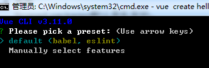

#### vue-cli 3.0的源码解析-（1）cmd命令篇
vue3简化了大量的webpack配置，开箱即用，项目中看不到以前常见的webpack.config, babel配置文件等，而是将配置文件进行了初始化配置放在@vue下的node-modules目录中。
##### @vue的命名空间 scope
cli-3将所有的cli相关配置node-module包放在了@vue的命名空间下，这样可以避免命名冲突和npm名称占用的问题
* 配置
npm 的scope在package.json中的配置：
```js
// package.json
{
  "name":"@username/project-name"
}
```
这样就使用了一个scoped 的npm包
也可以在npm init的时候指定
```js
npm init --scope=username
```
* 发布
Scoped packages默认是私有的；
npm的私有包和github的私有仓库一样是付费服务；
通过在发布时指定--access=publish选项可以发布为公有包。
```js
npm publish --access=public
```
* 使用
```js
{
  "dependencies": {
    "@username/project-name": "^1.0.0"
  }
}
```
npm私有包可以用来创建供公司，团队内部使用的私有npm项目，同样的方式还可以通过自建npm仓库的方式，例如使用[verdaccio](https://www.npmjs.com/package/verdaccio)包搭建。
更多信息访问 [https://docs.npmjs.com/creating-and-publishing-private-packages](https://docs.npmjs.com/creating-and-publishing-private-packages)

话不多说，直接使用vue-cli3构建一个项目：
```js
vue create hello-world
```
进入到cmd的交互式命令行
 
**发生了什么，计算机是怎么找到vue vue create hello-world命令的？**
其实计算机只是去执行了vue命令，后面都是参数
在计算机系统中存在path变量，当我们在bash命令行中键入一个命令时，系统回去PATH中找到该命令，打开path命令配置，我们找不到vue的全局命令，但是会找到
```bash
C:\Users\Administrator\AppData\Roaming\npm;
C:\Program Files\nodejs\;
```
其中vue-cli2我是安装在`C:\Users\Administrator\AppData\Roaming\npm`中的，cli-3是安装在`C:\Program Files\nodejs\`中的,进入到nodejs目录中，我们找到了vue.cmd文件，在windows中，该文件就是我们键入vue后enter执行的命令，打开该文件
```bash
@IF EXIST "%~dp0\node.exe" (
  "%~dp0\node.exe"  "%~dp0\node_modules\@vue\cli\bin\vue.js" %*
) ELSE (
  @SETLOCAL
  @SET PATHEXT=%PATHEXT:;.JS;=;%
  node  "%~dp0\node_modules\@vue\cli\bin\vue.js" %*
)
```
可以看到，最终的cmd中的vue命令是执行的node.exe程序，执行文件是全局安装的cli/bin/vue.js的文件。
接下来将会进入到node-module中的bin下的vue.js文件中进行分析


  

